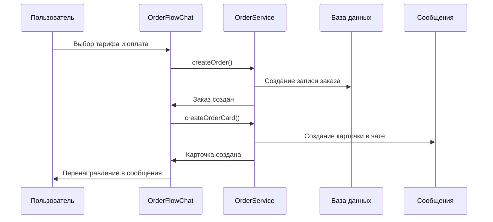
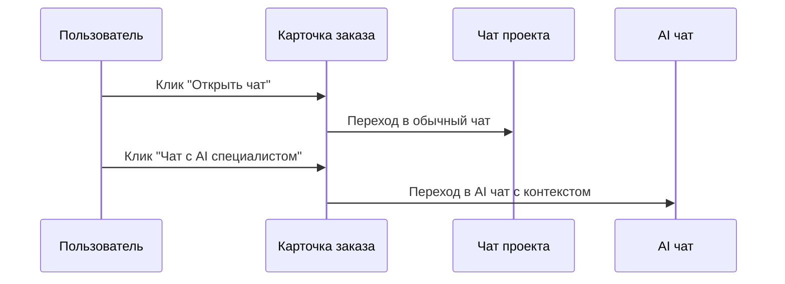

# Интеграция заказов с системой сообщений

## Обзор системы

После успешной оплаты услуг AI специалиста система автоматически:

1. **Создает заказ** в базе данных
2. **Создает карточку заказа** в системе сообщений
3. **Перенаправляет пользователя** в чат с проектом
4. **Уведомляет специалиста** о новом заказе

## Компоненты системы

### 1. OrderService (`src/lib/services/order-service.ts`)

Основная служба для работы с заказами:

```typescript
// Создание заказа
const order = await OrderService.createOrder({
  userId: 'user_123',
  specialistId: 'alex-ai',
  specialistName: 'Alex AI',
  specialistTitle: 'Full-Stack Developer',
  tariffId: 'premium',
  tariffName: 'Премиум',
  amount: 150,
  conversationId: 'conv_123',
  requirements: 'Создать React приложение...',
  timeline: '7 дней'
});

// Создание карточки заказа в сообщениях
const orderCard = await OrderService.createOrderCard({
  orderId: order.$id,
  userId: 'user_123',
  receiverId: 'specialist_123',
  specialist: { ... },
  tariff: { ... },
  requirements: 'Описание требований',
  conversationId: order.conversationId
});
```

### 2. OrderFlowChat (`src/components/OrderFlowChat.tsx`)

Компонент процесса заказа с интегрированной оплатой:

```typescript
const handlePayment = async (paymentInfo: any) => {
  // 1. Создание заказа
  const order = await OrderService.createOrder({ ... });
  
  // 2. Создание карточки в сообщениях
  const orderCard = await OrderService.createOrderCard({ ... });
  
  // 3. Перенаправление в сообщения
  setTimeout(() => {
    window.location.href = `/en/messages?orderId=${order.$id}`;
  }, 3000);
};
```

### 3. OrderCard (`src/components/messaging/OrderCard.tsx`)

Карточка заказа в системе сообщений с действиями:

- **"Открыть чат"** - обычные сообщения проекта
- **"Чат с AI специалистом"** - расширенный AI чат с контекстом заказа
- **"Просмотр прогресса"** - детали проекта

## Флоу пользователя

### 1. Процесс заказа



### 2. Взаимодействие в сообщениях



## API Endpoints

### GET /api/orders
Получение заказов пользователя:

```typescript
// Запрос
GET /api/orders?userId=user_123&action=list

// Ответ
{
  "success": true,
  "orders": [
    {
      "$id": "order_123",
      "specialistName": "Alex AI",
      "tariffName": "Премиум",
      "amount": 150,
      "status": "active",
      // ...
    }
  ]
}
```

### POST /api/orders
Создание заказа или карточки:

```typescript
// Создание заказа
POST /api/orders
{
  "action": "create",
  "userId": "user_123",
  "specialistId": "alex-ai",
  // ...
}

// Создание карточки
POST /api/orders
{
  "action": "create_card",
  "orderId": "order_123",
  "userId": "user_123",
  // ...
}
```

## Структуры данных

### Order
```typescript
interface Order {
  $id: string;
  userId: string;
  specialistId: string;
  specialistName: string;
  specialistTitle: string;
  tariffId: string;
  tariffName: string;
  amount: number;
  currency: string;
  status: 'pending' | 'active' | 'completed' | 'cancelled';
  conversationId: string;
  requirements: string;
  timeline: string;
  createdAt: string;
  updatedAt: string;
}
```

### OrderCardData
```typescript
interface OrderCardData {
  $id: string;
  orderId: string;
  userId: string;
  specialistId: string;
  specialist: {
    id: string;
    name: string;
    title: string;
    avatar: string;
  };
  tariff: {
    name: string;
    price: number;
    features: string[];
  };
  status: string;
  amount: number;
  requirements: string;
  conversationId: string;
  createdAt: string;
}
```

## Действия в карточке заказа

### handleActionClick
```typescript
const handleActionClick = (actionType: string) => {
  if (actionType === 'open_chat') {
    // Обычный чат проекта
    router.push(`/en/messages?ai_order=${order.orderId}&specialist=${order.specialist.id}`);
  } else if (actionType === 'chat_with_specialist') {
    // AI чат с контекстом заказа
    router.push(`/en/ai-specialists/${order.specialist.id}/chat?orderId=${order.orderId}&conversationType=order_chat`);
  } else if (actionType === 'view_progress') {
    // Детали проекта
    router.push(`/en/projects/${order.orderId}`);
  }
};
```

## Особенности реализации

### 1. Fallback механизм
Если создание заказа в базе данных не удается, система показывает демо-подтверждение:

```typescript
} catch (error) {
  console.error('Error creating order:', error);
  
  // Fallback: показываем подтверждение без создания заказа
  const confirmationMessage: Message = {
    id: (Date.now() + 5).toString(),
    role: 'system',
    content: 'Заказ успешно оформлен! (Демо-режим)',
    // ...
  };
}
```

### 2. Автоматическое перенаправление
После оплаты пользователь автоматически перенаправляется в сообщения через 3 секунды:

```typescript
// Перенаправляем в систему сообщений через 3 секунды
setTimeout(() => {
  window.location.href = `/en/messages?orderId=${order.$id}`;
}, 3000);
```

### 3. Контекст специалиста
AI чат сохраняет контекст заказа для продолжения работы:

```typescript
router.push(`/en/ai-specialists/${order.specialist.id}/chat?orderId=${order.orderId}&conversationType=order_chat`);
```

## Тестирование

### 1. Тест создания заказа
```bash
curl -X POST http://localhost:3000/api/orders \
  -H "Content-Type: application/json" \
  -d '{
    "action": "create",
    "userId": "test_user",
    "specialistId": "alex-ai",
    "specialistName": "Alex AI",
    "specialistTitle": "Full-Stack Developer",
    "tariffId": "premium",
    "tariffName": "Премиум",
    "amount": 150,
    "conversationId": "conv_test",
    "requirements": "Тестовые требования"
  }'
```

### 2. Тест получения заказов
```bash
curl "http://localhost:3000/api/orders?userId=test_user&action=list"
```

## Интеграция с AI специалистами

После создания заказа AI специалист получает полный контекст:

1. **Требования проекта** из чата заказа
2. **Выбранный тариф** и его особенности
3. **Временные рамки** выполнения
4. **История общения** с клиентом

Это позволяет AI специалисту:
- Продолжить беседу с полным пониманием контекста
- Предоставить персонализированные рекомендации
- Отслеживать прогресс по конкретному заказу
- Адаптировать стиль общения под выбранный тариф 